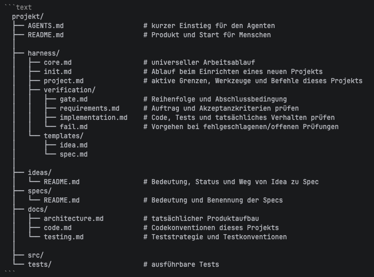

# Agentic Harness V3

Ein schlanker Ablauf und Vorlagen für Entwicklungsagenten.

| Pfad | Zweck |
| --- | --- |
| `AGENTS.md` | Projekteinstieg |
| `harness/` | Ablauf, Prüfung und Vorlagen |
| `docs/` | Projektwissen |
| `ideas/` | Ungeklärte Vorhaben |
| `specs/` | Beauftragtes Verhalten |
| `src/` | Anwendungscode |
| `tests/` | Tests |

`agentic-harness-v2-main/` enthält den V2-Vergleich.
