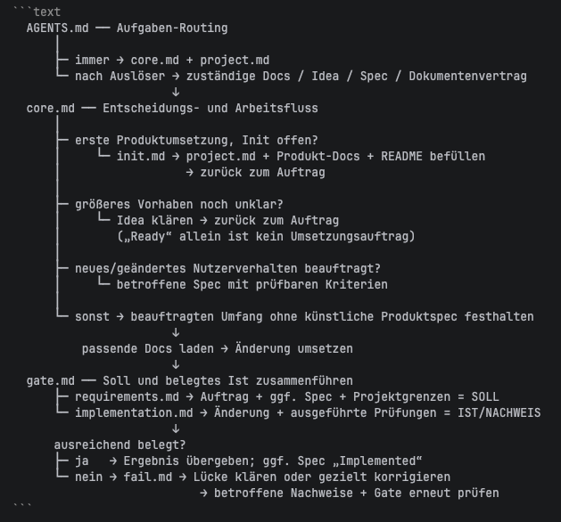

# Agentic Harness für neue Produktprojekte

Dieser technologieoffene Harness ist für neue, leere Produktprojekte gedacht – vom kleinen CLI- oder Web-Produkt bis zu größeren Vorhaben mit klar begrenztem erstem Meilenstein. Kopiere `AGENTS.md` und `agentic-harness/` in das neue Projekt; dort führt der Harness von Project Init über beauftragte Änderungen bis zur Verifikation.



## Empfohlen: in ein leeres Projekt kopieren

Kopiere **`AGENTS.md` und den gesamten Ordner `agentic-harness/`** aus diesem Repository unverändert ins Root des neuen Projekts. Nur zusammen stimmen die aktuellen Ladepfade.

```sh
HARNESS=/pfad/zum/agentic-harness-repo
PROJEKT=/pfad/zum/neuen-leeren-projekt
mkdir -p "$PROJEKT"
cp "$HARNESS/AGENTS.md" "$PROJEKT/"
cp -R "$HARNESS/agentic-harness" "$PROJEKT/"
```

Öffne danach das Zielprojekt mit deinem Coding-Agenten und beauftrage Project Init, z. B. „Kläre den ersten Nutzerablauf und initialisiere dieses neue Produktprojekt.“ Der Agent befüllt `agentic-harness/harness/project.md` und die betroffenen Projekt-Docs. Eine **Produkt-`README.md`** wird im Zielprojekt neu erstellt oder, falls vorhanden, mit bestätigten Produktinformationen ergänzt. Beobachtungen über mögliche **universelle** Harness-Verbesserungen können dort in `agentic-harness/harness-learnings.md` gesammelt werden; sie werden nicht automatisch in dieses Quell-Repository übernommen.

**Nicht mitkopieren:** Diese README ist nur die Anleitung zum Harness. `main.py` ist hier leer; `.venv/` ist eine lokale virtuelle Python-Umgebung (virtual environment). Auch `.idea/`, `assets/` und `.git/` sind kein benötigter Teil des Harnesses. Richte Umgebung und Produktcode für das Zielprojekt nach dessen Entscheidungen ein.

## Ganzes Repository als Ausgangspunkt

Du kannst das Repository auch klonen oder als Vorlage kopieren, musst dann aber die Harness-README durch eine Produkt-README ersetzen und nicht benötigte Dateien wie `main.py` und `assets/` entfernen. Das ist derzeit **kein automatischer Installer**; für ein neues Produkt ist das gezielte Kopieren der beiden oben genannten Bestandteile der einfachere Weg.
