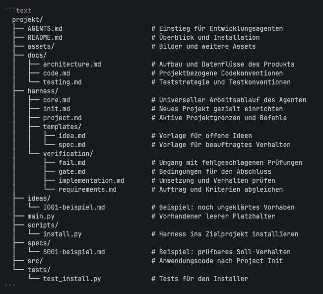

# Agentic Harness V3



Strukturübersicht als Text, falls GitHub das Bild nicht ausliefert:

```text
AGENTS.md            Einstieg für den Agenten
harness/             Core, Project Init, Projektprofil, Verifikation, Vorlagen
ideas/ und specs/    Klärung und beauftragte Anforderungen
docs/                Produktwissen und Konventionen
src/ und tests/      Anwendungscode und ausführbare Produkttests
```

**Ohne ZIP übernehmen:** Quelle einmal klonen, Kopierplan ansehen und den Harness ins Zielprojekt installieren (Python 3):

```bash
git clone https://github.com/FelixZimmermannDev/agentic-harness-v3.git ~/agentic-harness-starter
python3 ~/agentic-harness-starter/scripts/install.py --dry-run /pfad/zum/projekt
python3 ~/agentic-harness-starter/scripts/install.py /pfad/zum/projekt
```

Das Zielprojekt wird **kein Git-Clone** der Quelle. Die Quelle kann später mit `git -C ~/agentic-harness-starter pull --ff-only` aktualisiert werden; Projektdateien ändern sich dadurch nicht automatisch.

| Übernommene Markdown-Dateien | Umgang im Zielprojekt |
| --- | --- |
| `harness/core.md`, `harness/init.md` | Universeller Arbeitsablauf und Project Init: grundsätzlich unverändert. |
| `harness/verification/gate.md`, `harness/verification/requirements.md`, `harness/verification/implementation.md`, `harness/verification/fail.md` | Prüf- und Korrekturablauf: grundsätzlich unverändert. |
| `harness/templates/idea.md`, `harness/templates/spec.md` | Vorlagen unverändert; ausgefüllte Ideas und Specs später getrennt anlegen. |
| `ideas/README.md`, `specs/README.md` | Allgemeine Ablageregeln: unverändert. |
| `harness/project.md` | **Pflicht:** Mit bestätigten Projektgrenzen, Befehlen und Gate-Status befüllen. |
| `docs/architecture.md`, `docs/code.md`, `docs/testing.md` | **Bei Relevanz** mit Produktfakten und Konventionen befüllen; ungenutzte Platzhalter können entfallen. |
| `AGENTS.md` | Einstieg übernehmen; bei Bedarf um Verweise auf weitere geltende Projektdokumente ergänzen. |
| `docs/README.md` | Themenindex übernehmen; beim Anlegen zusätzlicher Docs ergänzen. |
| `src/README.md`, `tests/README.md` | Platzhalter bei echtem Anwendungscode beziehungsweise Produkttests ersetzen oder entfernen. |

Die Root-`README.md` dieses Starter-Kits wird **nicht kopiert**. Eine Produkt-README wird bei Project Init neu erstellt oder eine vorhandene ergänzt. `scripts/install.py` und `tests/test_install.py` bleiben in der Quelle.

**Abhängigkeiten – nur bei Relevanz laden:**

| Anlass | Benötigt | Ergebnis |
| --- | --- | --- |
| Jede Aufgabe | `AGENTS.md` → `harness/core.md` → `harness/project.md` | Arbeitsweg und aktive Projektgrenzen erkennen. |
| Neues Projekt, Profil noch `Pending Project Init` | `harness/init.md` → bestätigte Angaben in `harness/project.md`; passende `docs/` und Produkt-README ergänzen | Erste Umsetzung vorbereiten; Gate ausdrücklich offen lassen, bis echte Checks eingerichtet sind. |
| Größeres offenes Vorhaben / beauftragtes Nutzerverhalten | Bei Bedarf `ideas/README.md` + Idea-Vorlage; bei Auftrag `specs/README.md` + Spec-Vorlage | Geklärte Idea beziehungsweise prüfbare Spec; keine ungefragte Implementierung. |
| Umsetzung / Abschluss | Nur betroffene Spec und Docs; `harness/verification/gate.md` → `harness/verification/requirements.md` + `harness/verification/implementation.md` → Prüfungen aus `harness/project.md` | Nachweise je betroffenem Akzeptanzkriterium; bei Fehlschlag `harness/verification/fail.md` und erneut prüfen. |

Dieses Repository ist noch **kein initialisiertes Produktprojekt**: Installation legt nur die Struktur an, nicht Produktfakten oder ein funktionierendes Quality Gate. `Implemented` setzt tatsächlich bestandene Nachweise voraus.

Der Installer überschreibt keine abweichenden Dateien. Besteht bereits eine andere `AGENTS.md`, erfordert die Übernahme `--keep-agents` und anschließend einen **manuellen** Verweis auf `harness/core.md` und gegebenenfalls `harness/init.md`. Vorhandene Projektregeln und Docs müssen ebenfalls bewusst abgeglichen werden. Installer-Tests: `python3 -m unittest discover -s tests -p 'test_install.py'` – diese prüfen nicht das spätere Produkt.
