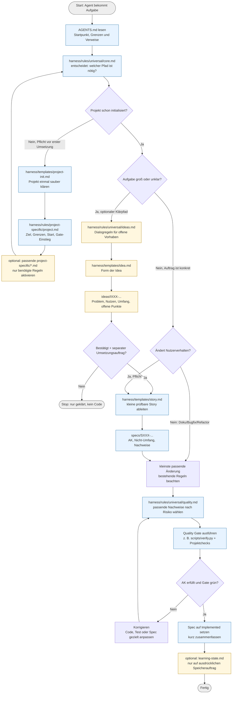

# Agentic Harness V2 – Workflow

Diese README ist bewusst kurz: Erst die Grafik lesen, danach bei Bedarf die genannte Datei öffnen.

**Legende:** Blau = normalerweise Pflicht im passenden Fall, Gelb = optional/bedarfsgeladen, Grau = Start oder Ende. Der Core ist die Weiche: Er entscheidet, ob Project Init, Idea, Spec oder direkt eine kleine Änderung genügt.

## Mini-Kommentar je Markdown-Datei

| Datei | Verantwortung |
|---|---|
| `AGENTS.md` | Einstiegskarte für Agenten; verweist auf die passenden Regeln, ohne den Core zu duplizieren. |
| `README.md` | Visuelle Orientierung über Workflow und Zuständigkeiten. |
| `learning-state.md` | Manuelle Sammlung bestätigter Erkenntnisse; nur auf ausdrücklichen Speicherauftrag pflegen. |
| `harness/rules/universal/core.md` | Universeller Ablauf und Entscheidung, wann Idea, Spec und Gate nötig sind. |
| `harness/rules/universal/ideas.md` | Regeln zur Klärung größerer oder unklarer Vorhaben vor einer Umsetzung. |
| `harness/rules/universal/quality.md` | Auswahlhilfe für passende Nachweise nach Risiko; keine Projektbefehle. |
| `harness/rules/project-specific/project.md` | Konkretes Projektprofil mit Ziel, Grenzen, Startweg und Gate-Einstieg. |
| `harness/rules/project-specific/code.md` | Projektweite Code- und Architekturkonventionen, falls benötigt. |
| `harness/rules/project-specific/python.md` | Python-Regeln für Projekte oder Aufgaben mit Python-Code. |
| `harness/rules/project-specific/web.md` | Web-Regeln für UI, Browser, Netzwerk und Accessibility, falls relevant. |
| `harness/rules/project-specific/testing.md` | Projektspezifische Testwerkzeuge, Fixtures, Testdaten und Konventionen. |
| `harness/rules/project-specific/quality-matrix.md` | Zuordnung von Projektbereichen zu Qualitätsnachweisen, wenn mehrere Risiken erklärt werden müssen. |
| `harness/templates/project-init.md` | Leitfaden für die einmalige Initialisierung eines konkreten Projekts. |
| `harness/templates/idea.md` | Vorlage für eine Idea: Problem, Nutzen, Umfang, Entscheidungen und offene Punkte. |
| `harness/templates/story.md` | Vorlage für eine prüfbare Story mit Akzeptanzkriterien und Nachweisen. |
| `ideas/I001-harness-v2.md` | Konkrete übergeordnete Idea zur Weiterentwicklung des Harness. |
| `specs/S001-starter-kit-init-and-quality-gate.md` | Umgesetzte Spec für Starter-Kit-Initialisierung und neutrales Quality Gate. |
